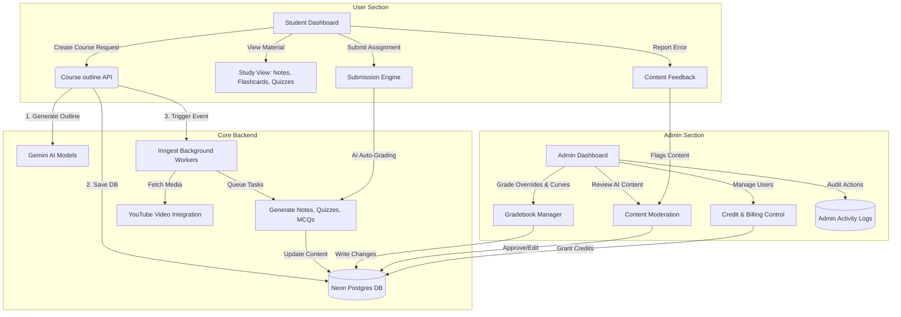

# Gemini LMS: Functional & Architectural Review

This document provides a comprehensive analysis of the features, UX workflow, and capabilities of the **Gemini LMS (ai-study-material-gen)** platform, split between the **User (Student) Section** and the **Admin / Instructor Portal**.

---

## 1. System Architecture Diagram

---

## 2. The User (Student) Section
The User Section is built to deliver a personalized, gamified, self-paced learning experience driven by generative AI. 

### Core Features & Strengths
1. **Dynamic Course Generator**:
   * Takes user variables (topic, course type like "Exam Prep" or "General", difficulty, categories) and constructs a structured multi-chapter layout in seconds.
   * Leverages Gemini to build chapters, summaries, emojis, and comprehensive study topics.
2. **Interactive Study Views**:
   * **Chapter Notes**: In-depth text explanations with code formatting where appropriate.
   * **Flashcards**: Interactive front-and-back flip cards using `react-card-flip` for active recall.
   * **Interactive Quizzes & MCQs**: Real-time evaluation checking correctness, tracking scores, and giving instantaneous explanation feedback.
   * **YouTube Video Embeds**: Dynamically fetches and assigns relevant educational video tutorials to match chapter themes.
3. **Assignments & Auto-Grading**:
   * Generates custom assignments alongside AI-defined rubrics.
   * Provides students with auto-graded AI feedback highlighting **strengths** and **areas for improvement**.
4. **Gamification & Engagement**:
   * **Global Learning Streaks**: Tracks daily learning patterns.
   * **Badges & Achievements**: Rewards learners as they finish notes, ace quizzes, or achieve milestones.
   * **Leaderboard**: Compares points and completed courses across the platform to encourage friendly competition.
5. **Certificates of Completion**:
   * Generates unique PDF certificates with verify links upon finishing chapters and tests.

> **UX Evaluation**: 🌟 **9/10 (Excellent)**  
> The student journey is extremely cohesive. Moving from course request to notes, interactive drills, and gamified metrics keeps students highly engaged. It does not feel like a passive reader, but an active trainer.

---

## 3. The Admin / Instructor Section
The Admin Portal is a high-control command center designed for tutors, content reviewers, and administrators to moderate the AI-generated experience.

### Core Features & Strengths
1. **Role-Based Control (RBAC)**:
   * Supports **Super Admin** (system control), **Admin** (billing/team management), and **Tutors** (moderation/grading).
   * Tutors are assigned to specific courses (`TUTOR_ASSIGNMENT_TABLE`) to limit their view to their respective topics.
2. **The Moderation Panel (Content Review)**:
   * Direct interface to review AI-generated materials (`CONTENT_REVIEW_TABLE`).
   * Tutors can approve the AI output as-is, make manual corrections to raw JSON fields, or delete inaccurate content before it reaches students.
   * Direct pipeline for student feedback: students flag AI bugs (e.g. a bad answer key), and administrators see and correct them immediately.
3. **Advanced Gradebook & Analytics**:
   * Detailed breakdown of class averages, assignment scores, and progression rates.
   * **Grade Curves**: Instructors can curve student marks globally (flat curves, compression, or custom scales).
   * **Deduction Engine**: Sets penalties for late assignment submissions.
   * **Predictive Analytics**: Utilizes past quiz/assignment metrics to warn admins about students categorized with "High" or "Critical" risk of failure.
4. **Platform & Billing Management**:
   * Manual credit adjustment panel to credit users or audit transactions.
   * Announcement editor for creating global banners.
5. **Security & Audit Logs**:
   * Admin actions are logged (`ADMIN_ACTIVITY_LOG_TABLE`) for accountability.
   * Tutors must request super-admin validation for overrides.

> **Control Evaluation**: 🌟 **9.5/10 (Superb)**  
> This is a highly mature admin dashboard. Most AI applications overlook the need for human-in-the-loop review. The content review dashboard and grade curve calculators elevate this from a basic AI app to a true classroom-grade tool.

---

## 4. Key Improvements Needed for Production

To make this product successful, the team must address the following design and technical items:

1. **Human-in-the-Loop Workflow Integration**:
   * Right now, when a course is generated, it immediately queues notes, quizzes, and assignments. 
   * *Improvement*: Allow courses to be flagged as `Draft` on creation, notifying an assigned tutor to review the layout, edit details, and click `Publish` before notes are generated and credits are subtracted.
2. **Clerk Auth sync to Admin Database**:
   * The admin panel uses custom email/password logins (`ADMIN_TABLE`) with cookies, while the user panel uses Clerk. 
   * *Improvement*: Unify the signup and authentication under Clerk (using Clerk organization roles or metadata properties) to avoid maintaining two separate security schemas.
3. **State Storage Refactoring**:
   * Shift in-memory rate-limiting maps and key rotation singletons to **Upstash Redis** or the database.
4. **Secure API Handlers**:
   * Wrap endpoints with session-check middlewares rather than trusting `req.body.createdBy` payloads.
