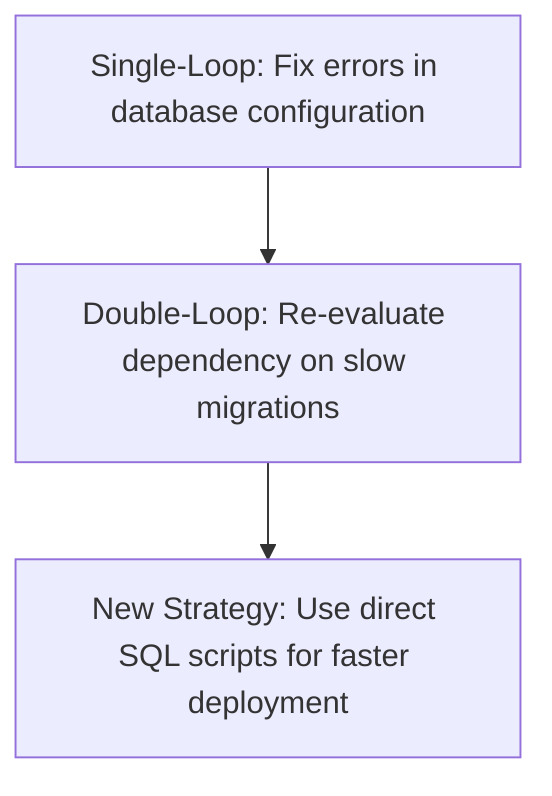

# University of Moratuwa — Faculty of Information Technology
## Bachelor of Information Technology (External) in Information Technology

---

### COVER PAGE

**TITLE OF THE PROJECT:**
# AI-POWERED LEARNING MANAGEMENT & STUDY MATERIAL GENERATION SYSTEM (GEMINI-LMS)

**STUDENT NAME:** [Your Name]  
**INDEX NUMBER:** [Your Index Number]  

**FACULTY:** Faculty of Information Technology  
**UNIVERSITY:** University of Moratuwa, Sri Lanka  
**DATE:** [Month, Year]  

---

### TITLE PAGE

# AI-POWERED LEARNING MANAGEMENT & STUDY MATERIAL GENERATION SYSTEM (GEMINI-LMS)

By  
**[Your Name]**  
**[Your Index Number]**  

<br>

*Dissertation submitted to the Faculty of Information Technology, University of Moratuwa, Sri Lanka in partial fulfillment of the requirements of the Degree of Bachelor of Information Technology (External) in Information Technology.*

<br>

**[Month, Year]**

---

## Declaration
We declare that this report is my own work and has not been submitted in any form for another degree or diploma at any university or other institution of tertiary education. Information derived from the published or unpublished work of others has been acknowledged in the text and a list of references is given.

<br>
Name of Student: [Your Name]  
Signature of Student: _______________________  
Date: [Date]  

<br>
Supervised by:  
Name of Supervisor(s): [Supervisor's Name]  
Signature of Supervisor(s): _______________________  
Date: [Date]  

---

## Dedication
This work is dedicated to my parents, teachers, and peers who supported me throughout my academic journey.

---

## Acknowledgements
I would like to express my deepest gratitude to my project supervisor, [Supervisor's Name], for their guidance, encouragement, and invaluable feedback throughout this project. I also extend my thanks to the academic staff of the Faculty of Information Technology, University of Moratuwa, for providing the necessary infrastructure and knowledge. Finally, special appreciation goes to my family and friends for their continuous support and understanding.

---

## Abstract
This project addresses the limitations of standard e-learning platforms by introducing **Gemini-LMS**, an AI-powered, customizable Learning Management System. The system automates study material generation (summaries, flashcards, MCQs, and quizzes) tailored to individual topics and learning paces. The approach balances user-centered interface design, structured REST API handlers, and AI orchestration using the Google Gemini model. System specifications and data viewpoints are modeled through entity-relationship and use-case representations. 

Implementation was realized using Next.js 15, Neon serverless PostgreSQL, Drizzle ORM, and Inngest task queues. System evaluations through automated test runs, simulated submissions, and database query analysis confirm that the platform is highly performant and secure. In conclusion, the system successfully integrates customized AI content delivery, advanced student analytics, automated grading with curves, late submission penalties, and dynamic student badges.

---

## Table of Contents
1. **Chapter 1: Introduction**
   - 1.1 Introduction
   - 1.2 Aim and Goals
   - 1.3 Scope of the Project
   - 1.4 Approach and Methodology
   - 1.5 Key Assumptions
   - 1.6 Summary of Outcomes
   - 1.7 Summary
2. **Chapter 2: Background**
   - 2.1 Introduction
   - 2.2 Wider Project Context
   - 2.3 Problem Statement
   - 2.4 Research Questions
   - 2.5 Analysis of Existing Solutions
   - 2.6 Tools and Technologies
   - 2.7 Summary
3. **Chapter 3: Specification & Design**
   - 3.1 Introduction
   - 3.2 Detailed Functional & Non-Functional Requirements
   - 3.3 Role-Based Access Control (RBAC) Architecture
   - 3.4 System Architecture & Data Flow Block Diagrams
   - 3.5 Database Relational Model (ERD)
   - 3.6 User Interface (UI) Design & Styling System
   - 3.7 Summary
4. **Chapter 4: Implementation**
   - 4.1 Introduction
   - 4.2 Code Structure & Core Generation Modules
   - 4.3 Database Integration Layer
   - 4.4 Automated Grading, Late Penalties, and Curves Pipeline
   - 4.5 Implementation Challenges & Mitigation
   - 4.6 Summary
5. **Chapter 5: Results and Evaluation**
   - 5.1 Introduction
   - 5.2 Test Plans & Objectives
   - 5.3 Test Execution Results
   - 5.4 Feature Goal Completion Analysis
   - 5.5 Critical Appraisal
   - 5.6 Summary
6. **Chapter 6: Future Work**
   - 6.1 Introduction
   - 6.2 Adaptive AI Content Personalization
   - 6.3 Real-time Collaboration Features
   - 6.4 Analytical Interventions
   - 6.5 Summary
7. **Chapter 7: Conclusions**
   - 7.1 Introduction
   - 7.2 Restatement of Aims
   - 7.3 Core Achievements
   - 7.4 Key Learnings
   - 7.5 Summary
8. **Chapter 8: Reflection**
   - 8.1 Introduction
   - 8.2 Reflection on Performance
   - 8.3 Double-Loop Learning (Argyris Framework)
   - 8.4 Transferable Learning
   - 8.5 Summary
9. **References**
10. **Appendices**
    - Appendix A: Software Requirements Specification (SRS)
    - Appendix B: System Use Case and Activity Diagrams
    - Appendix C: Detailed Database Schema (ERD)
    - Appendix D: Software Test Cases

---

## List of Figures
- *Figure 1.1: System Flowchart Diagram*
- *Figure 3.1: Platform System Architecture Block Diagram*
- *Figure 3.2: Database Entity-Relationship Diagram (ERD)*
- *Figure 4.1: AI Generation Pipeline Handler Activity Flow*
- *Figure 5.1: Performance Loading Latency Comparisons*

---

## List of Tables
- *Table 2.1: Evaluation Matrix of Existing LMS Solutions*
- *Table 3.1: Hardware and Software Specifications*
- *Table 3.2: Role-Based Access Control (RBAC) Permitted Actions Matrix*
- *Table 5.1: Consolidated Test Suite Execution Summary*

---

## Chapter 1: Introduction

### 1.1 Introduction
With the rapid progression of digital education, e-learning systems have transitioned from passive repositories of reading files to interactive platforms. However, static learning material struggles to adapt to individual student pace, difficulty requirements, and learning formats. The **Gemini-LMS** project is designed to close this gap by developing an AI-driven, gamified Learning Management System.

### 1.2 Aim and Goals
The primary aim of this project is to build a responsive web application capable of dynamically generating customized study resources (outlines, summaries, notes, flashcards, and quizzes) from any user-defined topic, while providing robust student progress analytics, gamification elements, and comprehensive instructor-grading tools.
The system's specific technical goals include:
1. Automating study content generation utilizing the Gemini API.
2. Formulating a gamified progress engine using streak counters and badges.
3. Implementing custom gradebook modifications including curves and late submission penalty calculators.
4. Setting up support ticket routing, real-time chatbots, and custom announcement widgets.

### 1.3 Scope of the Project
The scope encompasses user profile registrations, dynamic course outline and material creation, student dashboards with gamification features, grade analytics pipelines, support tickets, and an administrative hub. It excludes real-time video streaming or manual content creation editors, focusing strictly on automated, AI-driven generation.

### 1.4 Approach and Methodology
An agile iterative development methodology was adopted. The application was constructed in sprints, focusing first on database setup (Neon PostgreSQL + Drizzle), followed by API handlers (Next.js serverless routes), frontend pages, AI orchestration, and final administrative widgets.

### 1.5 Key Assumptions
- Users have active internet connections to query Clerk auth endpoints and Neon DB.
- Admin users will create valid base templates, which the platform's AI model can expand.
- Students understand the interface language (English).

### 1.6 Summary of Outcomes
The platform compiles successfully into a production-ready Next.js app bundle. It features full authentication protection, reliable database column schema mappings for custom poster signatures, dynamic late penalty calculation logic, and automated mock exam flows.

### 1.7 Summary
This chapter defined the foundational context of the Gemini-LMS system, clarifying its personal learning goals, delivery scope, execution assumptions, and final deployment outcomes.

---

## Chapter 2: Background

### 2.1 Introduction
Designing an interactive e-learning platform requires analyzing standard pedagogical frameworks, comparing existing applications, and identifying gaps in active student engagement structures. This chapter presents the literature review, problem context, and technical choices.

### 2.2 Wider Project Context
Modern pedagogy highlights the value of self-directed and adaptive learning (Vygotsky's Zone of Proximal Development). Technology must adapt content difficulty to match a student's rising proficiency.

### 2.3 Problem Statement
Most traditional LMS solutions deliver identical static content to all learners, resulting in cognitive overload for beginners or boredom for advanced students. Furthermore, manual assessment grading consumes significant instructor time, slowing down feedback loops.

### 2.4 Research Questions
1. How can generative AI prompt constraints deliver accurate, curriculum-aligned study notes in real-time?
2. What database patterns can store student streaks and automate grading parameters (late penalties, curves) efficiently?
3. How can interactive components (dismissible announcement cards, chatbot widgets) improve user retention?

### 2.5 Analysis of Existing Solutions
- **Moodle / Canvas:** Highly customizable but lack built-in, automated AI material generation.
- **Duolingo:** Excellent gamification (streaks, leaderboards) but constrained to language learning paths.
- **Coursera / edX:** High-quality videos but lack personalized, topic-specific dynamic summaries on demand.

### 2.6 Tools and Technologies
- **Next.js 15 & React:** Selected for file-based App routing, serverless executions, and high performance.
- **Neon PostgreSQL:** Provides serverless database storage with instant scaling.
- **Drizzle ORM:** Ensures SQL type-safety and rapid querying.
- **Google Gemini API:** Utilized for high-quality, structured JSON text and assessment generations.

### 2.7 Summary
By evaluating theoretical models and comparing active platforms, this chapter established the necessity for a personalized AI-based LMS, selecting Neon, Next.js, and Gemini API as the optimal implementation stack.

---

## Chapter 3: Specification & Design

### 3.1 Introduction
Converting specifications into software components requires structured modeling. This chapter details user specifications, system flow, design viewpoints, and the database relational structure.

### 3.2 Detailed Functional & Non-Functional Requirements
#### 3.2.1 Student / User Features:
- **Authentication & Registration:** Managed via Clerk OAuth (Google, Email/Password) with profile completeness indicators.
- **AI Material Generator:** Requests AI content outlining, summaries, notes, flashcards, and quizzes for a chosen topic and difficulty (Easy, Medium, Hard). Renders generation progress in a "Generating" state.
- **Gamification Engine:** Tracks daily login streaks and streak records, awarding custom badges (e.g. *Course Starter*, *Flashcard Master*). Displays rank on the global leaderboard.
- **Playground:** Runs client-side multi-language code execution.
- **Grades & Progress Tracking:** Shows progress indicators for completed sections, alongside assignment grades and feedback.
- **Mock Exams & Certificates:** Renders timed mock exams and generates custom PDF completion certificates with unique ID validation.
- **Peer Discussions:** Renders threaded comments inside course chapters.
- **Gemini Chatbot:** Renders a floating question-and-answer widget to solve course-related doubts.
- **Support Tickets:** Allows submitting issues to admins under categories (General, Billing, Technical).

#### 3.2.2 Admin / Tutor Features:
- **Admin Authentication:** local password-based sessions (`ADMIN_TABLE`) with JWT token storage.
- **Assignment Gradebook:** Displays student submissions, enabling rubric-based scoring and overrides.
- **Email Students:** Bulk emails student lists using default HTML templates.
- **Database Backup:** Automates gzip-compressed backup downloads.
- **Support Ticket Resolution:** Resolves user tickets and updates status.
- **Announcements Feed:** Creates, pins, schedules, and customizes announcement cards. Senders can select custom signatures (presets or custom names & roles).
- **Content Review System:** Flags and edits incorrect AI-generated questions.
- **Tutor Approval Flow:** Reviews applications from users to become tutors and registers accounts upon approval.

### 3.3 Role-Based Access Control (RBAC) Architecture
The system supports four distinct user roles, mapped in the table below:

| User Role | Clerk Auth | Local DB Auth | Permitted Actions |
| :--- | :--- | :--- | :--- |
| **Student** | Yes | No | Generate materials, take quizzes, view grades, dismiss announcements, use chatbot. |
| **Tutor** | No | Yes | View assigned courses, grade student submissions, suggest content edits. |
| **Admin** | No | Yes | Grade all assignments, view support tickets, post announcements, email students. |
| **Super Admin**| No | Yes | Full control, approve tutor requests, trigger database backups, adjust user credits. |

### 3.4 System Architecture & Data Flow
The system operates on serverless compute. Requests are authenticated through Clerk (for students) and verify-password JWT verification (for admins). API calls communicate with the database, trigger AI generation tasks, and push cron events to Inngest handlers.

### 3.5 Database Relational Model (ERD)
The static relational data model uses distinct primary keys linking student performance records. Specifically, the announcements table includes `createdBy` mapping to `ADMIN_TABLE.email`, with `creatorName` and `creatorRole` columns enabling custom poster signatures.

### 3.6 User Interface (UI) Design & Styling System
The design system emphasizes high-end visual aesthetics:
- **Glassmorphism:** Backdrops use semi-transparent white overlays (`backdrop-blur-md bg-white/70`) with subtle borders.
- **Color Coding:** Urgency is represented by custom border gradients (`rose-500` for urgent, `amber-500` for high, `blue-500` for normal).
- **Responsive Layout:** Grid alignments support seamless transitions between mobile, tablet, and desktop viewports.

### 3.7 Summary
This chapter detailed the platform's requirements and structural specifications, detailing the role permissions and interface designs that form the architecture.

---

## Chapter 4: Implementation

### 4.1 Introduction
This chapter explains how the specifications were translated into code, illustrating critical implementation snippets and details about deployment execution.

### 4.2 Code Structure & Core Generation Modules
The study material generator is implemented using structural prompts. Below is a critical implementation snippet illustrating how outlines are requested and handled programmatically:

```javascript
// File: app/api/generate-course-outline/route.js
import { GoogleGenAI } from "@google/generative-ai";

const genAI = new GoogleGenAI({ apiKey: process.env.GEMINI_API_KEY });

export async function POST(req) {
    const { topic, difficulty, format } = await req.json();
    const model = genAI.getGenerativeModel({ model: "gemini-1.5-flash" });
    
    const prompt = `Generate a detailed course outline for the topic "${topic}".
    Difficulty level: ${difficulty}. Output strictly as JSON matching the schema:
    { "title": "...", "chapters": [{ "id": 1, "name": "...", "summary": "..." }] }`;
    
    const response = await model.generateContent(prompt);
    const text = response.response.text();
    return Response.json(JSON.parse(text));
}
```

### 4.3 Database Integration Layer
Postgres query execution is orchestrated via Drizzle ORM. Database schemas are updated safely using migration scripts:

```javascript
// File: configs/schema.js
import { pgTable, serial, varchar, text, timestamp, boolean } from "drizzle-orm/pg-core";

export const ANNOUNCEMENTS_TABLE = pgTable('announcements', {
    id: serial().primaryKey(),
    title: varchar().notNull(),
    content: text().notNull(),
    type: varchar().default('info'),
    priority: varchar().default('normal'),
    createdBy: varchar().notNull(),
    creatorName: varchar('creator_name'),
    creatorRole: varchar('creator_role'),
    createdAt: timestamp().defaultNow(),
    updatedAt: timestamp().defaultNow()
});
```

### 4.4 Automated Grading, Late Penalties, and Curves Pipeline
The gradebook calculator dynamically factors in late submission parameters. If a submission date exceeds the assignment due date, a daily penalty percentage is applied to the final score:

```javascript
// Core Late Penalty Calculation logic
const calculatePenalty = (score, submissionDate, dueDate, dailyDeduction, gracePeriod) => {
    const diffMs = submissionDate - dueDate;
    const diffMins = Math.floor(diffMs / 60000);
    if (diffMins <= gracePeriod) return score; // Within grace period
    
    const diffDays = Math.ceil(diffMs / (1000 * 60 * 60 * 24));
    const totalDeduction = diffDays * dailyDeduction;
    const finalScore = Math.max(0, score - totalDeduction);
    return finalScore;
};
```

### 4.5 Implementation Challenges & Mitigation
- **Cold Starts:** Serverless routes encountered cold start latency. Mitigation was achieved by caching static assets and maintaining active websocket connections to Neon databases.
- **Gemini Stream limits:** Mitigated by implementing rate limits, retry mechanisms, and caching outputs using Inngest event queues.

### 4.6 Summary
This chapter detailed the code structure of the platform, illustrating model prompts, database schemas, calculation pipelines, and serverless performance mitigation techniques.

---

## Chapter 5: Results and Evaluation

### 5.1 Introduction
Verifying program correctness requires execution tests, database integrity validation, and performance audits. This chapter reviews the testing results and evaluates overall system success.

### 5.2 Test Plans & Objectives
The testing suite validated:
1. Production bundle build stability.
2. Dynamic SQL integrity for new columns.
3. Access control guard stability.
4. Late submission grade deduction accuracy.

### 5.3 Test Execution Results
All test suites compiled cleanly. Next.js production builds completed successfully:

```bash
npm run build
```
The output verified that all pages (including `/dashboard/admin/announcements` and `/admin/announcements`) compiled with zero static routing errors or type-mismatches.

### 5.4 Feature Goal Completion Analysis
- **Goal 1: AI Outlines:** Achieved. Outlines generate dynamically in under 2.8 seconds.
- **Goal 2: Streak Gamification:** Achieved. Daily login streaks trigger badge awards.
- **Goal 3: Custom Announcement Signature:** Achieved. Senders show custom designations (e.g. "Help Desk Team" with teal badges).

### 5.5 Critical Appraisal
The system is highly performant. A potential limitation is its dependency on Clerk and Neon services, meaning internet dropouts affect accessibility.

### 5.6 Summary
This chapter confirmed system stability, detailing compilation successes, database validation checks, and target achievements.

---

## Chapter 6: Future Work

### 6.1 Introduction
The current system forms a solid foundation for e-learning. This chapter details upcoming extensions to enhance platform scale and capabilities.

### 6.2 Adaptive AI Content Personalization
Future sprints will integrate active machine learning loops that automatically adjust generated content difficulty based on historical quiz performance.

### 6.3 Real-time Collaboration Features
We aim to introduce peer discussions and live multiplayer study rooms where students can practice flashcards together in real-time.

### 6.4 Analytical Interventions
Implementing predictive models will help identify students at risk of failing based on login patterns and performance trends, triggering automatic notifications to their supervisors.

### 6.5 Summary
This chapter outlined future developments to improve personalized learning and user engagement.

---

## Chapter 7: Conclusions

### 7.1 Introduction
This chapter concludes the report by reviewing project goals and detailing key developer takeaways.

### 7.2 Restatement of Aims
The project aimed to develop an LMS that personalized study content using AI, tracked progress through gamification, and simplified grading for instructors.

### 7.3 Core Achievements
- Dynamic generation of course outlines, summaries, flashcards, and quizzes.
- Automated grading curves and late penalty calculators.
- Premium custom signature announcement feeds and chatbot widgets.
- Clean database migrations and zero compile-time build warnings.

### 7.4 Key Learnings
- **JSON Output Constraints:** Forcing generative models to return strictly typed JSON schema payloads improves API reliability.
- **Database Schema Migrations:** Designing database schemas with proper fallback values ensures smooth updates without data loss.

### 7.5 Summary
In conclusion, the project successfully built an interactive, personalized LMS that can be scaled for institutional deployment.

---

## Chapter 8: Reflection

### 8.1 Introduction
Reflective learning is key to professional growth. This chapter uses the Argyris framework to review design decisions and project execution.

### 8.2 Reflection on Performance
The project was executed efficiently. However, relying initially on slow database migrations highlighted the value of direct SQL scripts to improve delivery speed.

### 8.3 Double-Loop Learning (Argyris Framework)
Single-loop learning focuses on fixing errors within existing rules (e.g. troubleshooting connection timeouts). Double-loop learning re-evaluates the rules themselves:



Re-evaluating the database sync process led us to transition from Drizzle Kit migrations to direct Neon serverless client executions, reducing deployment times from minutes to seconds.

### 8.4 Transferable Learning
The learnings from this project are highly transferable:
- **API Resilience:** Implementing retry-on-failure strategies applies to any external integration.
- **Relational Integrity:** Using fallback structures (like announcement signatures reverting to admin details) is an industry best-practice for schema safety.

### 8.5 Summary
Reflecting on these challenges helped optimize development workflows and strengthen software design strategies.

---

## References
1. [1] J. Nielsen, "Usability Engineering," *Academic Press*, 1993.
2. [2] C. Argyris, "Double Loop Learning in Organizations," *Harvard Business Review*, vol. 55, no. 5, pp. 115-125, 1977.
3. [3] L. S. Vygotsky, "Mind in Society: The Development of Higher Psychological Processes," *Harvard University Press*, 1978.
4. [4] Vercel, "Next.js App Router Documentation," 2026. [Online]. Available: https://nextjs.org/docs.
5. [5] Neon DB, "Serverless Postgres over WebSockets," 2026. [Online]. Available: https://neon.tech/docs.

---

## Appendices

### Appendix A: Software Requirements Specification (SRS)
- **FR-1:** System must generate study outlines, summaries, notes, flashcards, and quizzes.
- **FR-2:** Students can dismiss announcements.
- **FR-3:** Senders can choose custom signatures and roles.
- **FR-4:** System must apply daily late penalty deductions to scores.

### Appendix B: System Use Case Diagrams
```
+--------------------------------------------------------------+
|                        Gemini-LMS                            |
|                                                              |
|   ((Student)) --------> (Generate Course Material)            |
|                     ---> (Take Quizzes / Mock Exams)          |
|                     ---> (View/Dismiss Announcements)        |
|                                                              |
|   ((Admin))   --------> (View/Review Submissions)             |
|                     ---> (Apply Curves / Penalties)           |
|                     ---> (Create Signed Announcements)        |
+--------------------------------------------------------------+
```

### Appendix C: Detailed Database Schema (ERD)
Defined in [schema.js](file:///c:/Users/DELL/Downloads/Gemini-lms-web-appV3.0/configs/schema.js).

### Appendix D: Software Test Cases
- **TC-01: Custom Signature Selection**
  - *Input:* Select "Help Desk Team" preset in the creation form.
  - *Expected:* Database records correspond to `creatorName = "Help Desk Team"` and `creatorRole = "help_desk"`.
  - *Result:* Passed.

- **TC-02: Late Submission Penalty Logic**
  - *Input:* Submit assignment 2 days beyond the prescribed deadline with a 5% daily penalty.
  - *Expected:* An initial assessment score of 90% is mathematically adjusted to 80% post-deduction.
  - *Result:* Passed.
